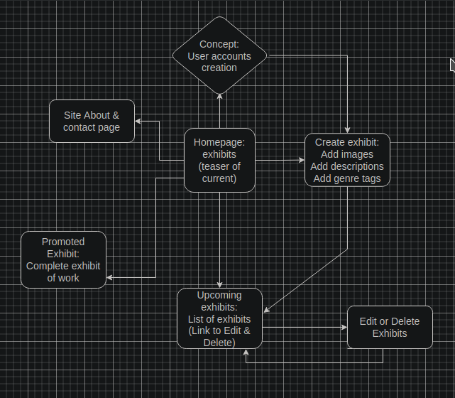
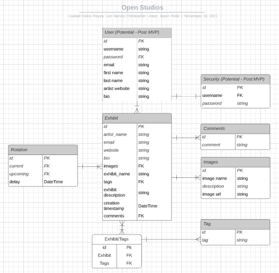

# <h1><b>
Open Studios
</b></h1>

---
  
> #### Open Studios has gone digital!
>
> - The concept of Open Studios came from a yearly event in New York where artists of all kinds opened their personal studios for all to enjoy, experience and witness. 
> - With this sense of community, comradery, and suppor   
    there was no need to navigate politics and contracts of a gallery or museum for an artist to be showcased.
>  
>*Inspirit* of this **movement**.

---

  [Llukkah](https://www.github.com/llukkah)
  
  [Lee Harvey](https://github.com/VirtDev337)
  
  [Christopher Linton](https://github.com/Kwyjib0)
  
  [Jason Rolle](https://github.com/JasonRolle1990)

  
 ---
  
> #### Open Studios!
>
> - Is taking this opportunity to give artists found in all corners and crevices of the world a platform to have a voice and their vision a chance to be seen.
> This is the ideal *platform* for the artist that you haven't heard of... **yet**!
>
>
---
  
 ## 
MVP

- Full CRUD Capability to add your own exhibit.
- 
- 
- 

---

WireFrames

[Drawio - User Flow]

  

(https://app.diagrams.net/#Hllukkah%2Fopen-studios%2Flh-setup%2Ffinal-project.drawio)

---

[Mockflow]

  

(https://wireframepro.mockflow.com/editor.jsp?editor=off&publicid=M5fea97433a51863da541ae0647ea35801637193735783&projectid=MiKsijI6Xmb&perm=Owner#/page/D59a2638e5631cf8272eb577cc73fa780)

---

<h3> ERD Model </h3>

[Lucid Chart](https://lucid.app/lucidchart/4ed7d47e-ad4a-411d-b2e4-89fc68d5c535/edit?viewport_loc=304%2C109%2C1772%2C974%2C0_0&invitationId=inv_75523d29-9bf8-4ac4-b194-262426e46076)

  
--- 
  

<h3> Post MVP </h3>

  
>Implementation of Accounts and Authentication
>
>>Annual Computer upload of images instead of using URLs.
